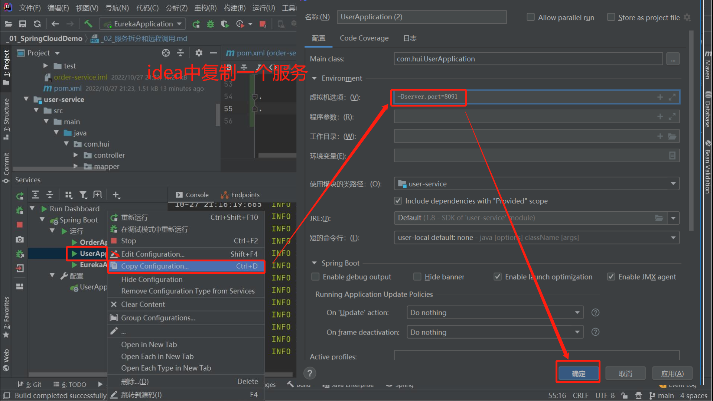

[注册中心_Eureka]

    Eureka功能描述:
        每个服务提供者启动时都会向eureka注册, 消费者根据服务名称从euraka拉取提供者信息
        当服务消费者同名具有多个时, 服务消费者根据负债均衡算法挑选空闲服务
        服务提供者每隔30秒向EurekaServer发送心跳, 心跳停止的服务将从注册中心删除信息
    Eureka架构:
        EurekaServer:
            服务端, 注册中心
            记录服务信息
            心跳监控
        EurekaClient:
            Provider/服务提供者: 
               注册自己的信息到EurekaServer
               每隔20秒向EurekaServer拉取服务列表
               基于服务列表做负债均衡, 选中一个微服务后发起远程调用
                    
[搭建和使用Eureka注册中心]
    
    Eureka使用简要流程:
        1. 搭建EurekaServer
            创建空的maven模块eureka-server, 在eureka-server模块pom中引入eureka依赖
            手动编写springBoot启动启动main函数, 添加Eureka注解开启服务
            yml文件中编写Eureka-server配置
        2. 提供者者服务在eureka注册
            在该服务的pom中引入eureka-client依赖
            在该服务的yml文件中配置eureka地址
        3. 消费者服务在eureka注册
            在该服务的pom中引入eureka-client依赖
            在该服务的yml文件中配置eureka地址
            在RestTemplate的Bean上添加负债均衡注解@LoadBalanced
            用服务体统者的服务名称远程调用
            
    
.   [2 创建空的maven工程Cloud-demo]
    
.   [2-1 创建并启动Eureka-server模块]  
        [2-1-1 创建空的maven模块eureka-server, 在eureka-server模块pom中引入eureka依赖](./eureka-server/pom.xml)  
        [2-1-2 手动编写springBoot启动启动main函数, 添加@EnableEurekaServer注解开启服务](./eureka-server/src/main/java/com/hui/EurekaApplication.java)   
        [2-1-3 yml文件中编写Eureka-server配置](./eureka-server/src/main/resources/application.yml)  
        
        该步骤后可在localhost:10086访问eureka的web页面

.   [2-2 服务提供者在Eureka注册]   
        [userService服务注册]     
            [2-2-1 将user-service注册为Eureka-client](./user-service/pom.xml)  
            [2-2-2 yml文件中编写Eureka-client配置(每个eureka-client必须包含application.name属性)](./user-service/src/main/resources/application.yml)  
        
.       [idea中复制启动user-service服务并启动]  
            

,   [2-3 服务消费者在Eureka注册并拉取使用其他已注册服务]  
        [2-3-1 将order-service注册为Eureka-client](./order-service/pom.xml)    
        [2-3-2 yml文件中编写Eureka-client配置(每个eureka-client必须包含application.name属性)](./order-service/src/main/resources/application.yml)   
        [2-3-3 修改需要使用的服务url, 将ip+port替换为服务名称](./order-service/src/main/java/com/hui/service/OrderService.java)  
        [2-3-4 在order-service配置的RestTemplate的Bean上添加负载均衡注解@LoadBalanced](./order-service/src/main/java/com/hui/config/HttpRestTemplateConfig.java)
    
    负债均衡:
        服务消费者基于服务名称获取服务列表, 然后根据负债均衡算法选取服务
        负债均衡规则根据Ribbon实现
        
